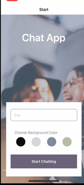
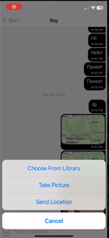

# Chat-app

## Description

* 
* 

Chat-app is a cross-platform chat application built using React Native and Expo. It allows users to engage in real-time text conversations, share photos, capture images from the camera, and exchange location data.

## Features

- Real-time chat with a user-friendly interface.
- Photo sharing: Post and view images within the chat.
- Camera integration: Capture and share images directly within the app.
- Location sharing: Share your current location with other users.

## Technologies Used

- React Native
- Expo
- Firebase (Firestore for message database and image storage)
- React Navigation
- Expo packages (async-storage, image-picker, location)
- Native components for iOS and Android

## Prerequisites

Before running the application, ensure that you have the following dependencies installed:

- Node.js
- Expo CLI (`npm install -g expo-cli`)

## Installation

1. Clone the repository: `git clone https://github.com/rarepearlgirl/chat-app.git`
2. Navigate to the project directory: `cd Chat-app`
3. Install dependencies: `npm install`

## Usage

1. Start the development server: `expo start`
2. Scan the QR code with the Expo Go app on your mobile device or run in an emulator.

## Contributing

If you'd like to contribute to Chat-app, please follow these guidelines:

1. Fork the repository and create a new branch for your feature or bug fix.
2. Make your changes and submit a pull request.
3. Ensure that your code follows the established coding style and conventions.

## Author
 - [rarepearlgirl](https://github.com/rarepearlgirl)

## License

This project is licensed under the [MIT License](https://opensource.org/license/mit/).

## Acknowledgments

Special thanks to the contributors and the open-source community.
Feel free to reach out if you have any questions or encounter issues. Happy chatting!
